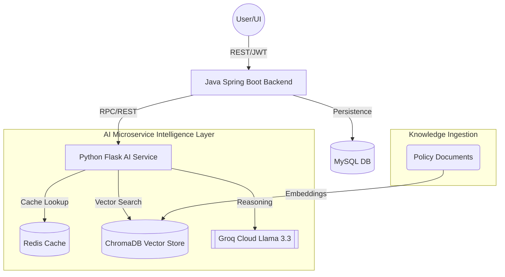

# Engineering Architecture — AI Risk Register

This document provides a technical deep dive into the AI Risk Register system. It is designed for engineers and stakeholders to understand the underlying mechanics, data flows, and architectural decisions that drive our intelligent risk management platform.

---

## 1. Overview
The AI Risk Register is a distributed system designed to automate the identification, classification, and mitigation of organizational risks. In modern enterprises, risk data is often unstructured, siloed, and difficult to prioritize. This system solves that problem by using **Large Language Models (LLMs)** and **Retrieval-Augmented Generation (RAG)** to transform raw text into actionable intelligence.

By decoupling the core business logic (Java/Spring Boot) from the specialized AI reasoning (Python/Flask), we achieve a highly scalable and resilient architecture capable of processing thousands of risks with millisecond-level retrieval times.

---

## 2. System Architecture

My architecture follows a modular, microservice-oriented design. The frontend interacts with the Java backend, which orchestrates data persistence and coordinates with the AI microservice for intelligence tasks.



### Architectural Layers:
1.  **Orchestration Layer (Java/Spring Boot)**: Responsible for authentication, transaction management, and the asynchronous triggering of AI tasks.
2.  **Intelligence Layer (Python/Flask)**: A specialized NLP service that encapsulates prompt engineering, vector search, and model interaction.
3.  **Persistence Layer (Multi-Store)**:
    *   **MySQL**: Stores relational metadata (risk IDs, user relationships, timestamps).
    *   **ChromaDB**: An AI-native vector database storing high-dimensional embeddings for RAG.
    *   **Redis**: An in-memory key-value store used to cache AI responses via deterministic SHA256 hashes.

---

## 3. AI Services Deep Dive

Each intelligence service is exposed as a stateless REST endpoint within the Flask environment.

### A. Risk Description & Categorization (`/describe`, `/categorise`)
*   **Purpose**: Transforms vague risk observations into structured, professional entries.
*   **Input**: `{"text": "string"}` (The raw risk observation).
*   **Process**: The system selects the appropriate prompt template, injects the user input, and calls the Groq Llama 3.3 model.
*   **Output**: A JSON object containing `title`, `description`, `impact`, `likelihood`, and `category`.

### B. Retrieval-Augmented Generation (`/query`)
*   **Purpose**: Answers domain-specific questions using the internal knowledge base.
*   **Input**: `{"text": "string"}` (The query).
*   **Process**:
    1.  Convert the query into a 384-dimension vector using `all-MiniLM-L6-v2`.
    2.  Query **ChromaDB** for the top 3 most similar document segments.
    3.  Inject these segments as "Context" into a specialized reasoning prompt.
    4.  The LLM generates a response constrained strictly to the provided context.
*   **Output**: `{"answer": "string", "sources": ["list of files"]}`.

### C. Batch Processing (`/batch-process`)
*   **Purpose**: High-throughput processing of multiple risks (up to 20 per request).
*   **Input**: `{"items": ["risk 1", "risk 2", ...]}`.
*   **Process**: Iterates through items with a mandatory **100ms inter-item delay** to respect Groq rate limits while maximizing concurrency via Flask's threaded server.
*   **Output**: A collection of structured results, including individual confidence scores and latency metrics.

---

## 4. Data Flow Trace

Tracing the lifecycle of a **Risk Creation** event:

1.  **Ingress**: A User POSTs a new risk to the Java Backend via `/api/risks`.
2.  **Persistence**: The Backend saves the raw risk to MySQL with a `PENDING_AI` status.
3.  **Asynchronous Trigger**: Using Spring's `@Async` executor, the Backend immediately sends a non-blocking request to the AI Service's `/describe` endpoint.
4.  **Sanitization**: The AI Service's `sanitiser.py` strips HTML and checks for prompt injection patterns using regex.
5.  **Cache Check**: The service computes a SHA256 hash of the input. If found in **Redis**, the cached result is returned instantly.
6.  **Model Inference**: On a cache miss, the service calls **Groq**. Llama 3.3 processes the prompt in <800ms.
7.  **Egress**: The AI response (JSON) is returned to the Backend, which updates the MySQL record with the enriched description and category.

---

## 5. Component Responsibilities

| Component | Responsibility |
| :--- | :--- |
| `app.py` | Flask entry point, blueprint registration, and global input sanitization. |
| `AiServiceClient.java` | Java-side client for AI service communication; manages timeouts and retries. |
| `groq_client.py` | Encapsulates the Groq API connection; handles prompt template loading and JSON repair. |
| `chroma_client.py` | Manages the vector store; handles embedding generation and similarity searches. |
| `job_queue.py` | Thread-safe in-memory manager for asynchronous tasks (e.g., long-form report generation). |
| `redis_cache.py` | Deterministic caching logic; maps input hashes to previously generated AI results. |

---

## 6. How to Run & Verify

### Environment Requirements:
- Python 3.11+
- Java 17+
- Redis Server (Port 6379)
- Groq Cloud API Key (`GROQ_API_KEY`)

### Setup Commands:
```powershell
# 1. Initialize Python Environment
cd ai-service
python -m venv venv
.\venv\Scripts\activate
pip install -r requirements.txt

# 2. Start the AI Microservice
python app.py
```

### Verification CLI Commands:
I use these commands to verify the health and functional correctness of the system:

```powershell
# Verify System Health
Invoke-RestMethod -Uri http://localhost:5000/health

# Verify Batch Processing (Phase 3 Milestone)
Invoke-RestMethod -Uri http://localhost:5000/batch-process -Method Post -ContentType "application/json" -Body '{"items": ["SQLi in login", "Vendor outage"]}'

# Verify Asynchronous Report Job (Phase 3 Milestone)
$job = Invoke-RestMethod -Uri http://localhost:5000/generate-report/async -Method Post -ContentType "application/json" -Body '{"text": "Generate a summary..."}'
Invoke-RestMethod -Uri "http://localhost:5000/generate-report/status/$($job.job_id)"
```

---

## 7. Glossary

*   **LLM (Large Language Model)**: A neural network trained on vast datasets to understand and generate human-like text. We use Llama 3.3.
*   **RAG (Retrieval-Augmented Generation)**: A technique that provides the LLM with specific, external context (like a policy doc) to improve accuracy and reduce hallucinations.
*   **Embeddings**: A numerical representation of text (a vector) that captures semantic meaning. Similar meanings have vectors that are "closer" in multi-dimensional space.
*   **Vector Database (ChromaDB)**: A specialized database designed to store and query embeddings using "Nearest Neighbor" algorithms.
*   **SSE (Server-Sent Events)**: A standard for streaming data from the server to the client in real-time over a single HTTP connection.
*   **Deterministic Caching**: A method where the same input always generates the same key (hash), ensuring we never waste tokens on identical requests.
*   **Prompt Injection**: A security vulnerability where a user attempts to "trick" the AI into ignoring its instructions by providing malicious input.
